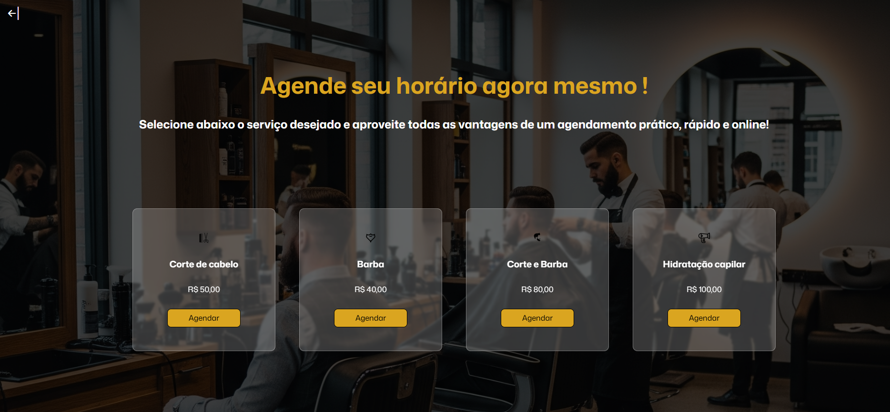
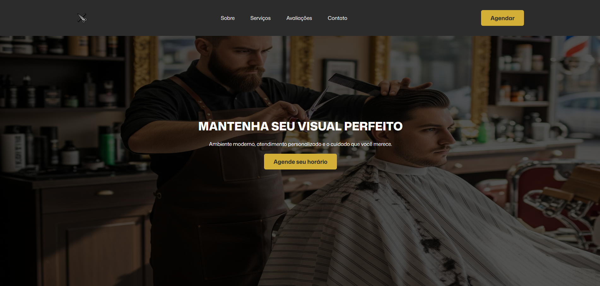
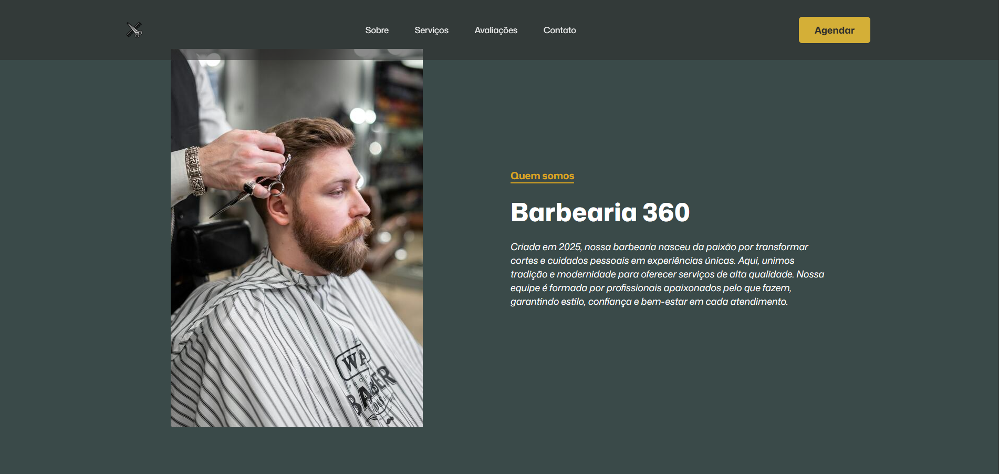
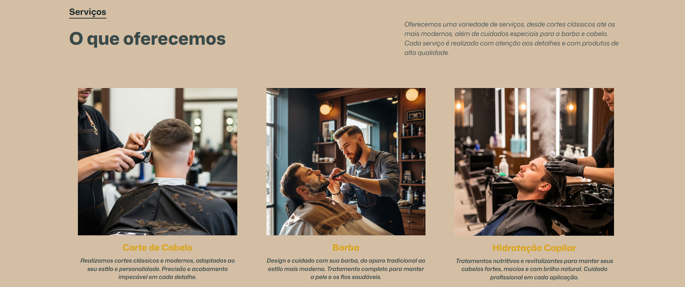
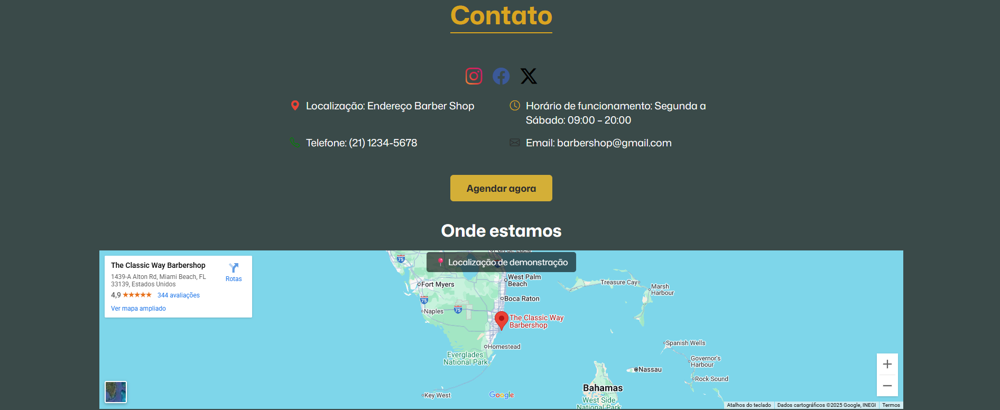

# 💈 Barbearia 360 - Sistema de Agendamento


> Um projeto front-end que simula um sistema de agendamento moderno, dinâmico e interativo para uma barbearia. O sistema permite que os usuários visualizem os serviços e agendem um horário em uma interface intuitiva.

### 🖼️ Demonstração



## 🖼️ Telas do Projeto

    
   

---

## ✨ Funcionalidades Principais

O projeto foi construído de forma incremental, adicionando diversas funcionalidades profissionais:

* **Seleção de Serviços:** Interface inicial com cards para cada serviço oferecido.
* **Modal de Agendamento Dinâmico:** Um pop-up moderno que não trava a página, construído do zero.
* **Geração de Horários Dinâmica:** Os horários não são fixos no código. Eles são gerados em tempo real baseados em regras de negócio (dias de trabalho, horário de abertura/fechamento).
* **Validação de Horários em Tempo Real:**
    * Impede o agendamento em horários que **já passaram** no dia atual.
* **Validação de Datas:**
    * Impede o agendamento em **datas passadas**.
    * Impede o agendamento para o **próximo ano**, mantendo as reservas no ano corrente.
* **Interface Aprimorada:**
    * O campo de data **não é digitável**, forçando o uso do calendário e evitando erros.
    * Utiliza a biblioteca **SweetAlert2** para exibir alertas de sucesso e erro de forma moderna e elegante.
* **Estrutura Organizada:** O código é modular e os arquivos estão organizados em pastas (`pages`, `css`, `js`).

---

## 💻 Tecnologias Utilizadas

<div>
    
    
    
    
    
</div>

Este projeto foi construído utilizando tecnologias web fundamentais, sem a necessidade de frameworks complexos.

* **HTML5:** Estruturação semântica do conteúdo.
* **CSS3:** Estilização completa, utilizando conceitos de Flexbox para responsividade.
* **JavaScript (Vanilla JS):** O cérebro do projeto, responsável por toda a interatividade, manipulação do DOM, validações e geração dinâmica de conteúdo.
* **SweetAlert2:** Biblioteca externa para a criação de alertas modernos.
* **Bootstrap Icons:** Biblioteca para uso de icons.

---

## 🚀 Como Rodar o Projeto

Este é um projeto puramente front-end, então não necessita de um servidor ou passos complexos de build.

1.  **Clone o repositório:**
    ```bash
    git clone https://github.com/fformentini/barbershop.git
    ```

2.  **Navegue até a pasta do projeto:**
    ```bash
    cd barbershop
    ```

3.  **Abra o arquivo principal no navegador:**
    Abra o arquivo `index.html` (que está na raiz do projeto) diretamente no seu navegador de preferência.

E pronto! Você já pode interagir com o sistema de agendamento.

---

## 🔮 Próximos Passos / Melhorias Futuras

Este projeto é um excelente protótipo front-end. Os próximos passos para torná-lo uma aplicação completa envolvem a construção de um back-end:

### Front-end e Deploy
-   [x] **Responsividade:** Adicionar media queries para otimizar a visualização em dispositivos móveis e tablets.
-   [ ] **Deploy:** Publicar o projeto online utilizando plataformas como **Vercel** ou **Netlify** para que possa ser acessado por qualquer pessoa.

### Back-end (Evolução para uma Aplicação Real)
-   [ ] **Criar um Back-end:** Utilizar Node.js, Python ou outra tecnologia para gerenciar os dados.
-   [ ] **Integrar um Banco de Dados:** Para armazenar os agendamentos de forma permanente, impedindo agendamentos duplicados.
-   [ ] **Sistema de Autenticação:** Permitir que clientes e administradores façam login.
-   [ ] **Painel Administrativo:** Para o dono da barbearia gerenciar os horários e serviços.
---

## ✍️ Autor

Projeto desenvolvido por **Fabrício Formentini** como parte de um estudo prático de desenvolvimento web front-end. Entre em contato!

<a href="https://www.linkedin.com/in/fformentini/" target="_blank">
    
</a>
<a href="https://github.com/fformentini" target="_blank">
    
</a>
